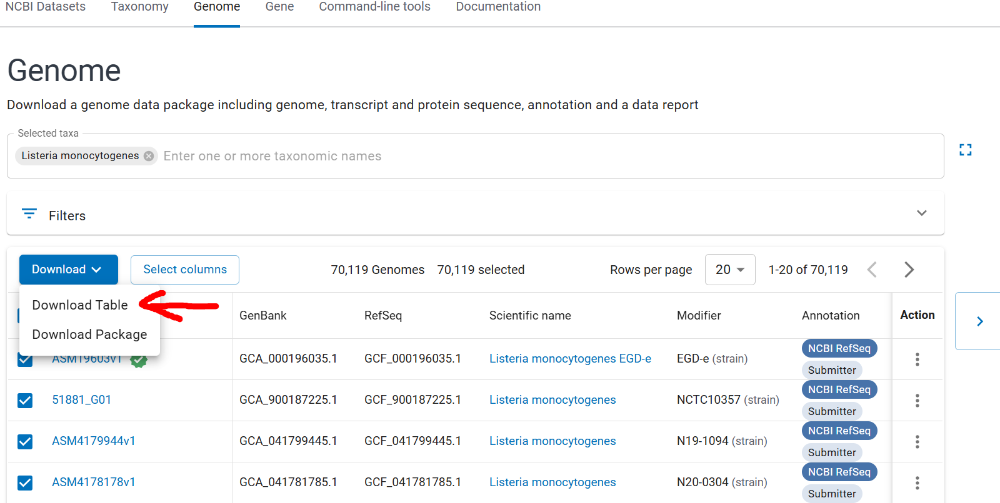

# BLAST at local computer (V: CLI-0.1)
**Current Version provides commandline compatible rsync download for large amount of genome from NCBI genome Datasets**

Here we provide a tool **Blast_at_local_computer.ipynb** for the following works:
* download genome data from NCBI
* check downloaded genome data files by MD5 value
* make a local custom genome database
* update the local custom genome database
* run BLAST search against the local custom genome database
* extract BLAST hit sequences

Although the original notebook still covers the end-to-end BLAST workflow, this CLI-focused release concentrates on the downloading and verification stages so you can prepare large collections of genomes for later analysis.

## Dependencies

### Operating system and command line utilities
* GNU/Linux environment with Bash shell
* `rsync` for high-volume downloads
* Coreutils providing `md5sum`
* Optional: `ncbi-blast+` for downstream BLAST usage in the notebook

### Python
* Python 3.9 or newer
* Packages: `biopython`, `pandas`, `numpy`

Install the Python packages with:
```bash
python -m pip install biopython pandas numpy
```

## Code organization

All Python sources now live inside the top-level ``src/`` directory. This keeps
the repository root tidy and makes future reorganizations easier. Add the
directory to your ``PYTHONPATH`` (for example with
``export PYTHONPATH=src:$PYTHONPATH``) when running code outside of the provided
CLI entry point.

Within ``src/`` the helper routines that power the CLI live in the
``blast_at_local_tools`` package. The previous monolithic
``blast_at_local_tools.py`` module has been split into focused submodules:

* ``metadata.py`` – Entrez lookups and FTP manifest generation
* ``transfers.py`` – rsync address conversion, genome downloads, and gunzip
* ``md5_ops.py`` – MD5 manifest conversion, download, and validation helpers
* ``blast_db.py`` – local BLAST database construction and archival utilities
* ``blast_pipeline.py`` – parallel BLAST execution helpers
* ``results.py`` – sequence and tabular extraction from BLAST output

Once ``src/`` is on your import path, ``import blast_at_local_tools`` exposes the
same public functions as before, so existing notebooks and scripts can continue
to work without further changes.

## Download FTP address

The genome data should be downloaded from the NCBI FTP site according to the FTP address. To get the FTP address, a custom assembly ID table should be provided as shown in the following steps:
1. go to the NCBI Assembly website
2. search the assemblies for the costumed genome database
3. download the ID table 

Here is an example to get assembly ID table for *Listeria monocytogenes*. 

By *Download -> Download Talbe -> Create File, a `TSV` file can be downloaded.

The downloaded table contains assembly accessions (GCA/GCF identifiers). Save a plain-text list with one accession per line—this file will be referenced by the CLI in the following steps.

### Command line workflow overview

All commands are executed from the project root with:
```bash
python src/blast_at_local_computer.py <subcommand> [options]
```
Use `--help` on any subcommand to inspect available flags.

1. **Fetch assembly metadata and FTP links**
   ```bash
   python src/blast_at_local_computer.py metadata-download \
    --gca-list assembly_ids.txt \
    --download-path Data/ \
    --workers 2 \
    --email your@email
   ```
   * `metadata-download` contacts NCBI Entrez, saves JSON metadata, and writes FTP links into `Data/ftp/`.
   * Provide your contact email via `--email` or set the `NCBI_EMAIL` environment variable.
   * If any assemblies fail, retry with `metadata-retry --error-file link_download_error.txt`.

2. **Enrich metadata with BioSample attributes (country/location, host, isolate, source, year)**
   ```bash
   python src/blast_at_local_computer.py metadata-enrich \
   --json-path Data/jsons/ \
   --output-tsv Data/metadata_enriched.tsv \
   --workers 2 \
   --email your@email \
   --error-file Data/metadata_enrich_error.txt
   ```
   * This reads JSON files created by `metadata-download`, fetches BioSample XML, and writes an enriched TSV.
   * Key output fields include `country_location`, `isolate`, `host`, `isolation_source`, and `year`.
   * Use `--error-file` to store record-level enrichment failures without interrupting the full run.

3. **Convert FTP links to rsync addresses**
   ```bash
   python src/blast_at_local_computer.py make-rsync \
   --ftp-path Data/ftp/ \
   --rsync-path Data/rsync/ \
   --processes 4
   ```
   This scans the FTP text files and creates rsync-ready address batches under `Data/rsync/`.

4. **Download genomes through rsync**
   ```bash
   python src/blast_at_local_computer.py genome-download \
   --rsync-path Data/rsync/ \
   --genome-path Data/download_genome/ \
   --workers 2
   ```
   * Downloads each genome archive via rsync using the adaptive task scheduler.
   * Default worker count is `2`.
   * Warning: if `--workers > 5`, the CLI prints a warning because NCBI rsync allows max 50 connections, but fewer than 5 is strongly suggested.
   * If the command is interrupted, use `genome-retry` to resume unfinished genomes based on existing files.

5. **Prepare MD5 checksum address list**
   ```bash
   python src/blast_at_local_computer.py md5-address \
   --ftp-path Data/ftp/ \
   --md5-address-path Data/md5_address/ \
   --processes 4
   ```
   Each FTP entry is converted into the location of its companion `md5checksums.txt` file.

6. **Download MD5 checksum files**
   ```bash
   python src/blast_at_local_computer.py md5-download \
   --md5-address-path Data/md5_address/ \
   --md5-download-path Data/download_md5/ \
   --workers 2
   ```
   * Retrieves checksum manifests for every genome batch.
   * Default worker count is `2`.
   * Warning: if `--workers > 5`, the CLI prints a warning because NCBI rsync allows max 50 connections, but fewer than 5 is strongly suggested.
   * Re-run failed transfers with `md5-retry`.

7. **Validate downloads using MD5**
   ```bash
   python src/blast_at_local_computer.py md5-check \
   --generated-path Data/generated_md5/ \
   --download-path Data/download_md5/ \
   --processes 4 \
   --not-match-output Data/md5_not_match.txt
   ```
   Generated MD5 values can be compared against the downloaded manifests. Use the notebook utilities to create local MD5 lists before running this command. Mismatch IDs are always written to file; if `--not-match-output` is omitted, the default output is `$PWD/md5_not_match.txt`.

8. **Decompress genome archives**
   ```bash
   python src/blast_at_local_computer.py gunzip \
   --genome-path Data/download_genome/ \
   --workers 4
   ```
   This helper extracts all `*.gz` files in parallel once you are confident in the checksum validation. Warning: if `--workers > 15`, the CLI warns that HDD throughput may not handle so many simultaneous decompressions.

## Notes on blast and downstream analysis

The CLI is intentionally limited to acquisition, verification, and preparation steps. Tasks such as database construction, BLAST execution, and hit extraction remain available through the original **Blast_at_local_computer.ipynb** notebook or your preferred tooling. This separation keeps the command line interface focused on the high-volume download workflow.

## Citation
If you use blast_at_local_computer in a scientific publication, we would appreciate citations to the following paper:
> Ma, X., Chen, J., Zwietering, M. H., Abee, T., & Den Besten, H. M. W. (2024). Stress resistant *rpsU* variants of *Listeria monocytogenes* can become underrepresented due to enrichment bias. International Journal of Food Microbiology, 416, 110680. https://doi.org/10.1016/j.ijfoodmicro.2024.110680
