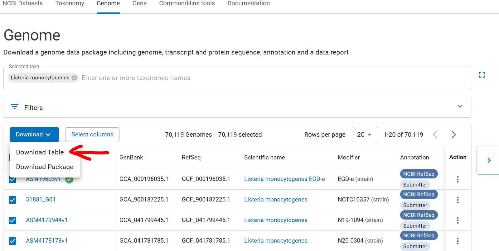

# BLAST at local computer (V: CLI-0.2)

This repo helps you download NCBI genome assemblies in batches, organize the downloaded packages, and run BLAST against those genomes on a local computer.

It is designed for users who start from an NCBI Assembly or Datasets TSV table and want a reproducible path from that table to a local BLAST database. The command-line script handles the downloading step with the NCBI `datasets` CLI. The Jupyter notebook then handles the BLAST step after the packages have been extracted.

Use this repo when you want to:

* convert an NCBI assembly TSV table into the accession-list format expected by `datasets`
* split many assemblies into practical download batches
* choose which NCBI Datasets package files to download, such as genome FASTA, GFF3, GTF, protein, CDS, or GBFF
* keep download commands, batch manifests, logs, and metadata together for later audit
* build local BLAST databases from extracted NCBI Datasets packages

The current workflow is:

1. Download an NCBI genome assembly TSV table.
2. Use this repo to extract assembly accessions from the TSV.
3. Batch accessions into `datasets download genome accession --inputfile ...` calls.
4. Download and extract NCBI Datasets packages.
5. Use `Blast_at_local_computer.ipynb` to build BLAST databases and run local BLAST searches.

This version replaces the old rsync-oriented workflow with the current NCBI Datasets workflow.

## Download The Assembly TSV

Start from the NCBI Assembly or Datasets genome table, filter to the assemblies you want, and download the table as TSV. The TSV can include many columns; this repo will extract the Assembly accessions from it.



The full NCBI table is not the direct input format expected by `datasets`. The `datasets` CLI expects Assembly or BioProject accessions as command arguments, or a plain text `--inputfile` with one accession per line. This repo converts TSV tables into that accession-list format.

## Batch Size

NCBI documents the regular genome-package download workflow as best for smaller downloads: fewer than 1,000 genomes or less than 15 GB, whichever is smaller. For 1,000 or more genomes, NCBI recommends the dehydrated workflow: download a metadata/location zip, unzip it, then run `datasets rehydrate`.

This repo conservatively batches accession lists at up to 1,000 assemblies per `datasets` call. That keeps each request inside the documented small-download range and makes retries/auditing practical.

References:

* NCBI regular genome downloads: https://www.ncbi.nlm.nih.gov/datasets/docs/v2/how-tos/genomes/download-genome/
* NCBI large genome downloads: https://www.ncbi.nlm.nih.gov/datasets/docs/v2/how-tos/genomes/large-download/
* NCBI `datasets download genome` reference: https://www.ncbi.nlm.nih.gov/datasets/docs/v2/reference-docs/command-line/datasets/download/genome/

## Dependencies

### Command Line Tools

* GNU/Linux environment with Bash shell
* NCBI `datasets` CLI
  * If `datasets` is not in `$PATH`, pass `--datasets-bin /path/to/datasets` or set `NCBI_DATASETS_CLI=/path/to/datasets`.
* `ncbi-blast+` for the notebook BLAST workflow

### Python

* Python 3.10 or newer
* Packages: `biopython`, `pandas`, `numpy`

Install Python packages with:

```bash
python -m pip install biopython pandas numpy
```

## Download Workflow

Run all commands from the repository root.

### Dry Run

Use `--dry-run` first to inspect accession extraction, batch files, and generated commands without downloading packages.

```bash
python src/blast_at_local_computer.py datasets-download \
  --assembly-table assemblies.tsv \
  --output-path Example/output/ncbi_datasets \
  --include genome,gff3,gtf,protein \
  --batch-size 1000 \
  --limit 10 \
  --dry-run
```

> After checking the dry-run output, run the same command without `--dry-run` to download packages. `--limit` is for tests and probes; omit it for production runs.

### Download Packages

```bash
python src/blast_at_local_computer.py datasets-download \
  --assembly-table assemblies.tsv \
  --output-path Example/output/ncbi_datasets \
  --include genome,gff3,gtf,protein \
  --datasets-bin /path/to/datasets \
  --batch-size 1000 \
  --workers 1 \
  --extract
```

The command writes:

* `resolved_accessions.txt` - deduplicated accession list
* `batches/*.txt` - one accession list per `datasets` call
* `packages/*.zip` - downloaded NCBI Datasets zip packages
* `extracted/*/` - extracted package contents when `--extract` is used
* `download_commands.sh` - shell-quoted commands for audit or manual reruns
* `batches_manifest.tsv` and `logs/failed_batches.tsv` - batch status files

### Choose Package Contents

Use `--include` to choose package elements. Supported values mirror NCBI `datasets`:

* `genome`
* `rna`
* `protein`
* `cds`
* `gff3`
* `gtf`
* `gbff`
* `seq-report`
* `all`
* `none`

Convenience aliases are accepted: `fasta` maps to `genome`, and `gff` maps to `gff3`.

### Large Downloads

For large jobs, use the dehydrated workflow:

```bash
python src/blast_at_local_computer.py datasets-download \
  --assembly-table assemblies.tsv \
  --output-path Example/output/ncbi_datasets \
  --include genome,gff3,protein \
  --batch-size 1000 \
  --dehydrated \
  --extract \
  --rehydrate
```

## Accession Selection

When an assembly table contains paired GenBank (`GCA_`) and RefSeq (`GCF_`) rows, the default is:

```bash
--source-preference refseq
```

That keeps one RefSeq accession per paired assembly when available. Other options are:

* `--source-preference genbank`
* `--source-preference as-is`
* `--source-preference both`

## Jupyter BLAST Workflow

Use **Blast_at_local_computer.ipynb** after package extraction. The notebook:

* writes a manifest of package files found under `Example/output/ncbi_datasets/extracted/`
* builds BLAST databases from discovered genomic FASTA files
* runs BLAST against the local databases
* extracts hit sequences and tabular results

Core notebook calls:

```python
import blast_at_local_tools as b

b.write_datasets_file_manifest(
    "Example/output/ncbi_datasets/extracted",
    "Example/output/ncbi_datasets/file_manifest.tsv",
)

b.make_blast_databases_from_datasets(
    "Example/output/ncbi_datasets/extracted",
    blastdb_path="Example/output/blast_db",
    file_type="genome",
    process_num=2,
)
```

## Bundled Examples

Small input examples live in `Example/input/`. Small output examples live in `Example/output/`. The `Example/output/ecoli_three_input_download/` folder contains the accession list, batch manifest, generated command, and Datasets metadata files from a three-assembly test run. Large downloaded FASTA/GFF/GTF files and zip packages are intentionally left out; regenerate them with the download command when needed.

## Deprecated Legacy Workflow

The previous FTP/rsync workflow is deprecated in this repo because NCBI is moving away from that access pattern. Legacy helper modules may remain temporarily for compatibility, but new usage and documentation should use `datasets-download` and **Blast_at_local_computer.ipynb**.

## Citation

If you use blast_at_local_computer in a scientific publication, we would appreciate citations to:

> Ma, X., Chen, J., Zwietering, M. H., Abee, T., & Den Besten, H. M. W. (2024). Stress resistant *rpsU* variants of *Listeria monocytogenes* can become underrepresented due to enrichment bias. International Journal of Food Microbiology, 416, 110680. https://doi.org/10.1016/j.ijfoodmicro.2024.110680
